# Tracklane

Modern, AI-first project management for teams that want their own.

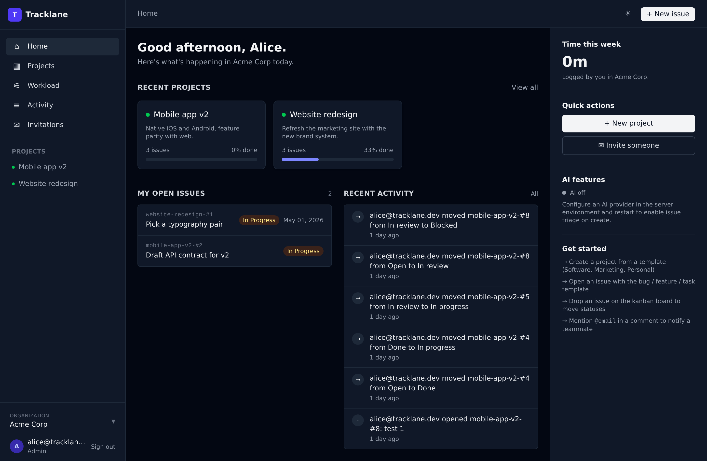

## What it does

Tracklane is a multi-tenant project management platform. Teams collaborate across projects, track issues, run kanban boards, keep a wiki per project, and see their work on a timeline. Instead of bolting AI on as a feature, Tracklane uses Claude in the core workflow: it triages new issues, and a project-scoped chat answers questions across every issue and comment the project has ever produced.

## Who it is for

- Teams that want a complete project management surface without a 2006-era experience
- Organizations that need privacy and data sovereignty, so self-hosting is the default
- Operators who prefer to own their stack and run it on their own infrastructure rather than trust a closed SaaS

## Feature tour

### Dashboard home

Greeting, recent projects with progress bars, my open issues, live activity feed, and quick actions. Light and dark themes.

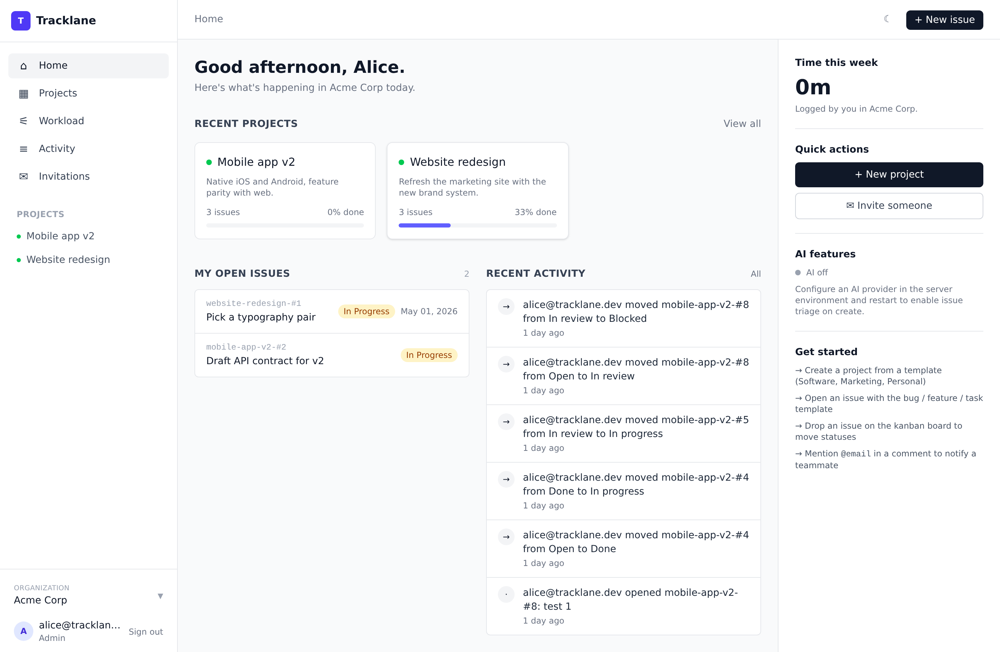

### Kanban board

Five status columns with drag-and-drop. Moves are persisted immediately and broadcast via Turbo Streams so every user on the board sees changes without a refresh.

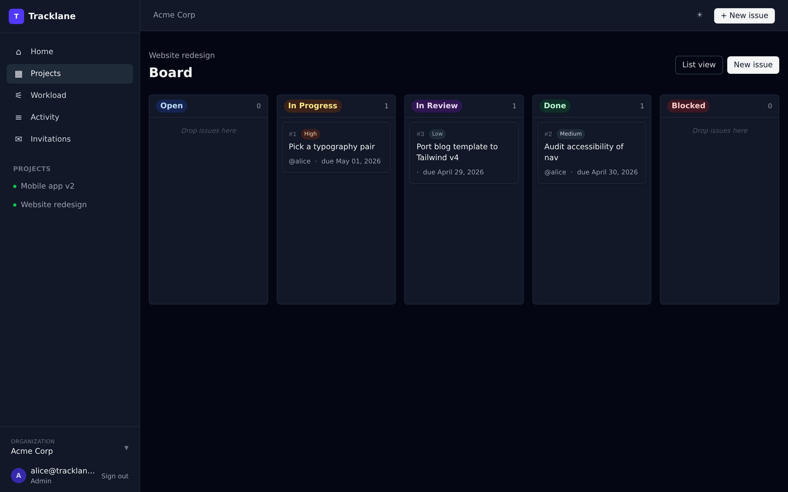

### Issue detail

Description, comments with `@email` mentions that trigger notifications, time log, and the AI triage card when enabled.

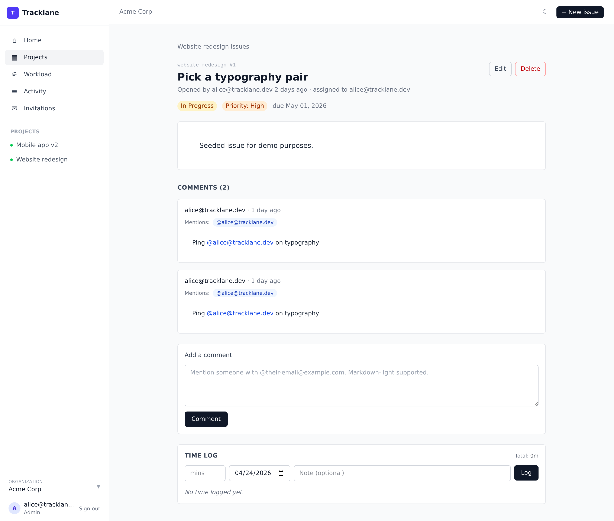

### Timeline / Gantt

Horizontal timeline per project driven by start and due dates. Weekends dimmed, today highlighted, colored by status.

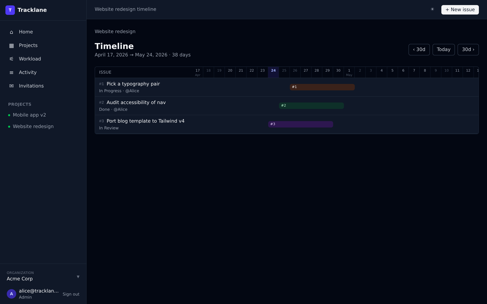

### Workload

Every open issue in the organization grouped by assignee, with a count per status plus a total. Makes overloaded teammates visible at a glance.

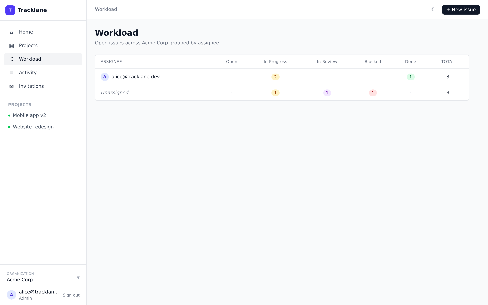

### Calendar

Monthly grid of issue due dates per project, with navigation and a Today shortcut.

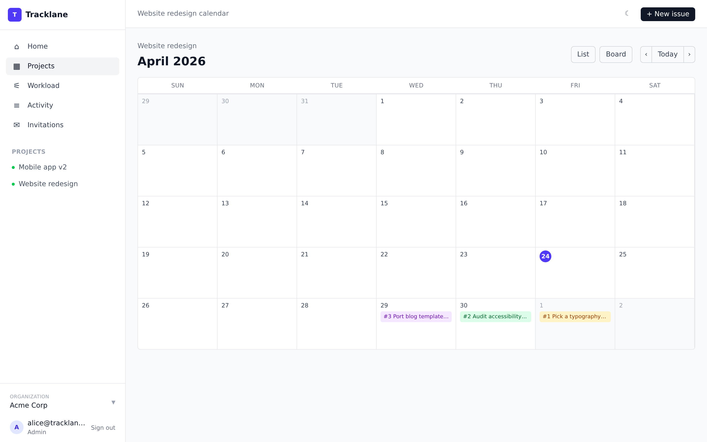

### Activity feed

Org-scoped stream of issue opens, board moves, assignments, comments, invitations, time logs, wiki edits, and project creations. Live updates via Turbo Streams.

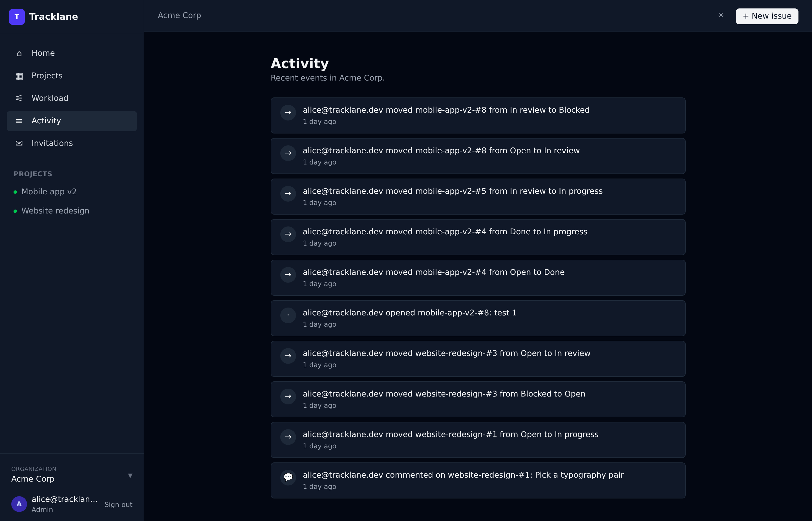

### Wiki per project

Markdown pages per project. Great for onboarding notes, specs, retros.

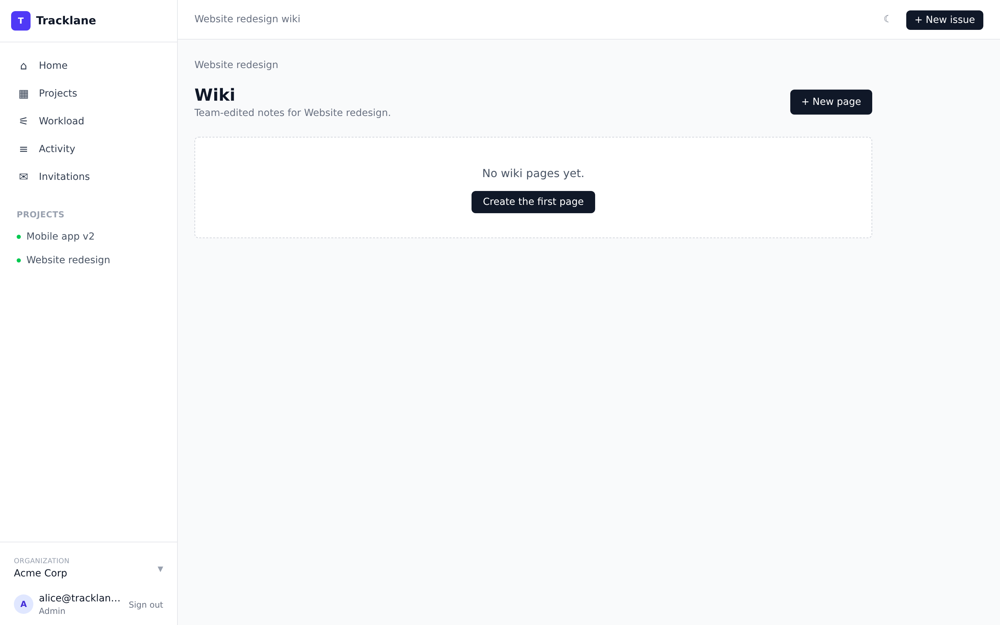

### Ask your project (AI, optional)

A project-scoped chat that answers questions using only the project's issues, comments, and description as context. Answers cite the source issue.

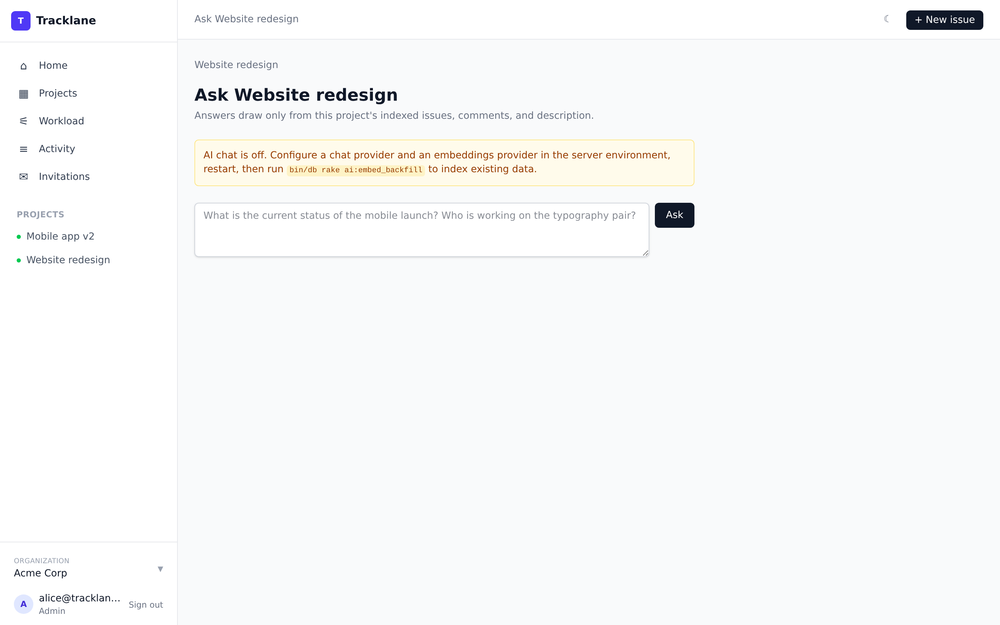

### Invitations

Admins invite teammates by email. Invitations carry a role and expire in 7 days.

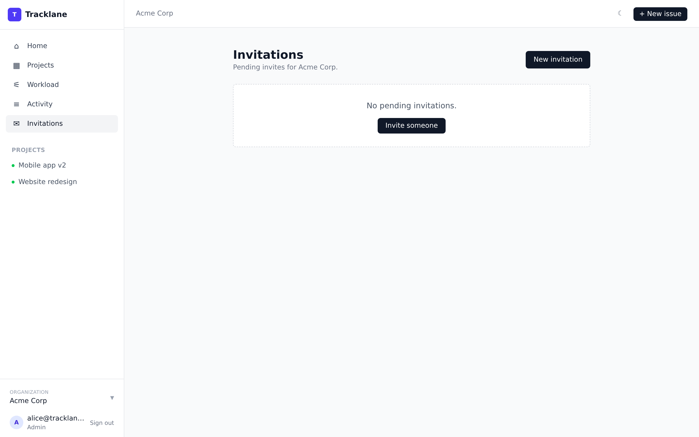

### New project with templates

Optional templates seed starter issues for Software team, Marketing campaign, or Personal workspace.

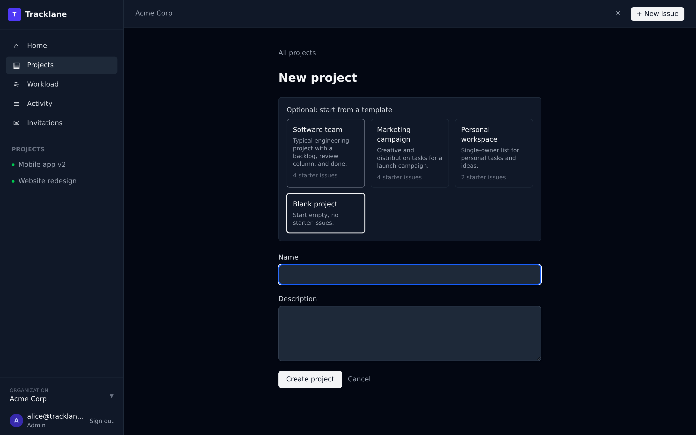

## Core capabilities

### Project management

- Organizations with multiple projects per organization
- Role-gated access: admin, manager, member, viewer
- Issues with status, priority, assignee, start date, due date
- Per-project sequential issue numbers (slug-#1, slug-#2)
- Comments, @mentions, and activity feed per project
- Kanban board with drag-and-drop and live updates across every connected user
- Calendar view with issues on their due dates
- Timeline view (Gantt-style) with per-issue bars and weekend dimming
- Workload view grouped by assignee across the whole organization
- Wiki per project with Markdown editing
- Time tracking per issue with per-user and per-week totals
- Email notifications for assignments, mentions, and pending invitations

### AI that earns its place

- **Issue triage.** New issues get an AI-suggested priority, labels, and assignee based on the description and who works in the organization. The user confirms or overrides. Bring-your-own-key, off by default.
- **Ask your project.** A chat interface that answers questions across every issue, comment, and wiki page in the project using pgvector retrieval. Answers cite the source. Bring-your-own-key, off by default.

### Multi-tenant by design

- Two-level hierarchy: Organization contains Projects
- Postgres Row-Level Security on every tenant-scoped table
- Per-request `app.current_organization_id` and `app.current_user_id` GUCs set by the `TenantScoping` concern
- Separate Postgres roles: owner (runs migrations) vs app (NOSUPERUSER NOBYPASSRLS, what Rails connects as)
- 79 integration tests, 200 assertions, verifying cross-tenant SELECT / INSERT / UPDATE / DELETE all fail

### Team infrastructure

- Hosted or self-hosted: run Tracklane on your own infrastructure
- Invitation flow with 7-day signed tokens
- Light and dark themes with instant async toggle
- Modern sidebar, top bar, and right rail

## Roadmap

### Phase 1 · Core foundations

- Organizations, memberships, and roles
- Projects and invitations
- Issues, comments, and mentions
- Kanban board with live updates
- Activity feed and email notifications

### Phase 2 · AI layer

- Issue triage on create
- Ask your project chat
- Daily team digest (planned)
- Meeting-to-tickets extractor (planned)

### Phase 3 · Polish

- Gantt/timeline view
- Time tracking
- Wiki
- Outbound webhooks (planned)
- Production deploy target (planned)

## Screenshots

See every surface at a glance in [public/screenshots](public/screenshots).
